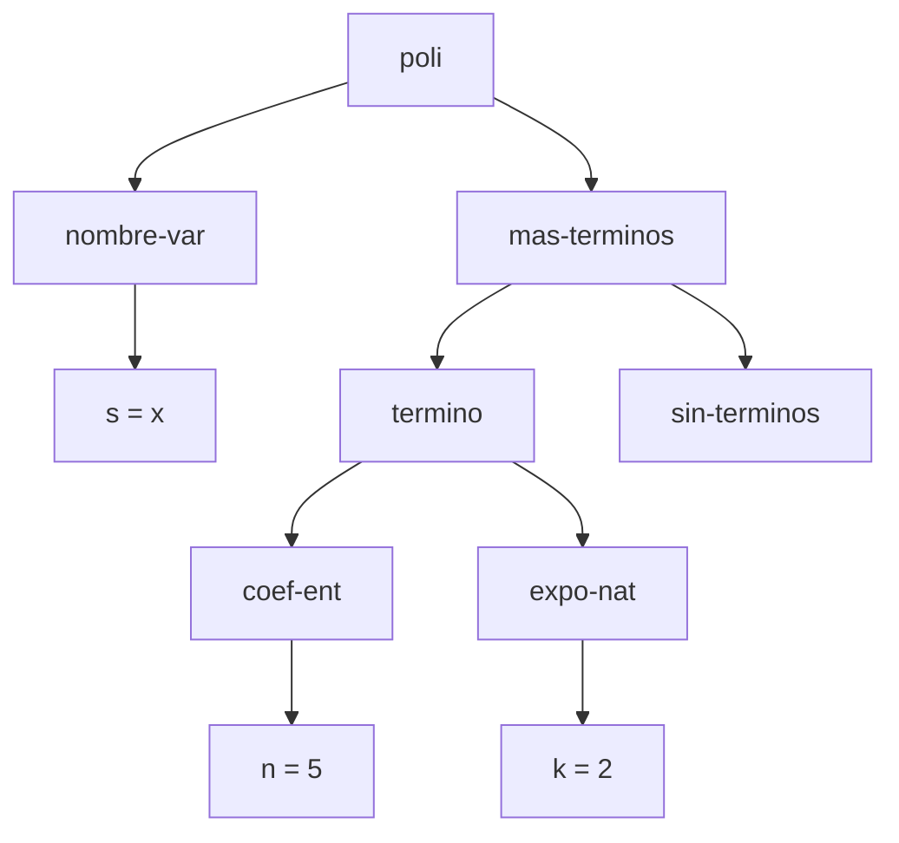
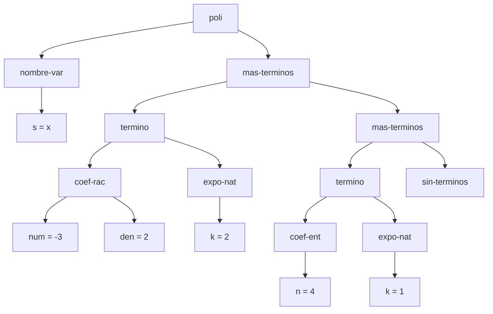
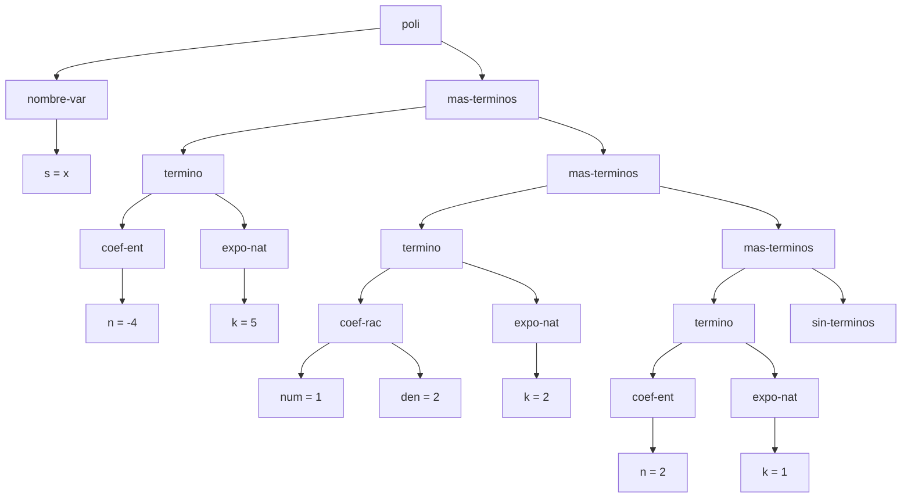
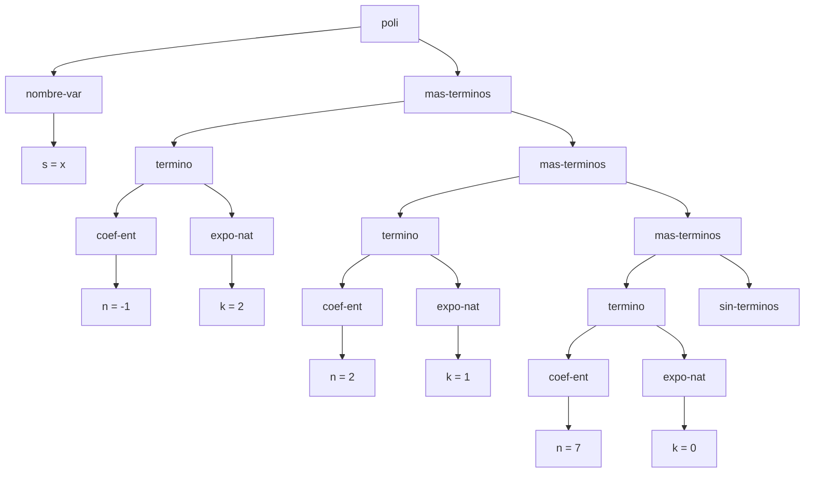
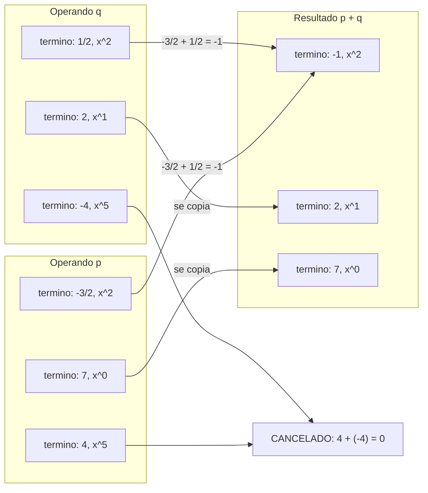

# Informe de AST — Taller 1: Un TAD con tres caras

**Autores:** Valentina Valencia Lopez (2459626), Aura Maria Pelaez Luna (2459422)

## 0. Gramática y convenciones

La gramática del TAD es:

```
<polinomio>    ::= <variable> <terminos>          poli(var, terms)
<variable>     ::= <symbol>                        nombre-var(s)
<terminos>     ::= '()                             sin-terminos()
                 | <termino> <terminos>            mas-terminos(term, resto)
<termino>      ::= <coeficiente> <exponente>       termino(coef, expo)
<coeficiente>  ::= <int>                           coef-ent(n)
                 | <int> "/" <int>                 coef-rac(num, den)
<exponente>    ::= <int>                           expo-nat(k)
```

Convenciones de los diagramas:

- Cada nodo interno lleva el nombre de un constructor de la gramática.
- Las hojas (`s`, `n`, `num`, `den`, `k`) llevan el valor concreto que guarda el campo.
- Los hijos de `mas-terminos` se leen de izquierda a derecha: primero `term` y después `resto`.
- Los términos aparecen en orden estrictamente decreciente de exponente (invariante del TAD).

---

## 1. Polinomio de un solo término con coeficiente entero

Polinomio: $p_1(x) = 5x^2$.

Dato: `(poli (nombre-var 'x) (mas-terminos (termino (coef-ent 5) (expo-nat 2)) (sin-terminos)))`



**Lectura:** la raíz `poli` tiene dos hijos: la variable `x` y la lista de términos. La lista tiene un único `mas-terminos`, cuyo `resto` es `sin-terminos` (lista vacía), y cuyo `term` es el término $5x^2$.

---

## 2. Polinomio de dos términos, uno con coeficiente racional

Polinomio: $p_2(x) = -\tfrac{3}{2}x^2 + 4x$.

Dato:
```
(poli (nombre-var 'x)
  (mas-terminos (termino (coef-rac -3 2) (expo-nat 2))
    (mas-terminos (termino (coef-ent 4) (expo-nat 1))
      (sin-terminos))))
```



**Lectura:** el coeficiente racional se guarda con `coef-rac`, con numerador y denominador por separado como hojas (`num = -3`, `den = 2`). El coeficiente entero usa `coef-ent`. Los dos términos están encadenados con dos `mas-terminos` y el primero tiene el exponente mayor.

---

## 3. Polinomio de tres o más términos con término independiente

Polinomio: $p(x) = 4x^5 - \tfrac{3}{2}x^2 + 7$ (el mismo de la Parte 3 del taller).

Dato:
```
(poli (nombre-var 'x)
  (mas-terminos (termino (coef-ent 4) (expo-nat 5))
    (mas-terminos (termino (coef-rac -3 2) (expo-nat 2))
      (mas-terminos (termino (coef-ent 7) (expo-nat 0))
        (sin-terminos)))))
```


**Lectura:** hay tres `mas-terminos` encadenados y, al final, `sin-terminos`. El último término, $7x^0$, es el término independiente: tiene `expo-nat` con `k = 0`. Los exponentes bajan $5 > 2 > 0$, como exige el invariante.

---

## 4. Resultado de `(sumar p q)`

Polinomios del ejemplo de la Parte 3 del taller:

- $p(x) = 4x^5 - \tfrac{3}{2}x^2 + 7$ (su árbol es el del caso 3).
- $q(x) = -4x^5 + \tfrac{1}{2}x^2 + 2x$.
- $p + q = -x^2 + 2x + 7$.

### 4.1 Árbol de $q$



### 4.2 Árbol del resultado $p + q$



### 4.3 Origen de cada nodo del resultado

`sumar` recorre las dos listas en paralelo, una sola vez, comparando los exponentes de las cabezas. El siguiente diagrama muestra de qué operando viene cada término del resultado:



| Nodo del resultado | Origen | Explicación |
|---|---|---|
| `nombre-var` con `s = x` | Ambos | Se verifica que $p$ y $q$ estén en la misma variable y se conserva la de $p$. |
| `termino` de $x^2$, `coef-ent -1` | **Ambos** ($p$ y $q$) | Exponentes iguales: $-\tfrac{3}{2} + \tfrac{1}{2} = -1$. La suma es un entero, así que el resultado es `coef-ent`, no `coef-rac`. |
| `termino` de $x^1$, `coef-ent 2` | Solo $q$ | $p$ no tiene $x^1$, así que el término de $q$ se copia sin cambios. |
| `termino` de $x^0$, `coef-ent 7` | Solo $p$ | $q$ no tiene término independiente, así que el de $p$ se copia sin cambios. |
| Términos de $x^5$ | **Se cancelaron** | $4 + (-4) = 0$, así que no aparece ningún nodo en el resultado. |

### 4.4 Traza de `sumar-terminos`

| Paso | Cabeza de $p$ | Cabeza de $q$ | Comparación | Acción |
|---|---|---|---|---|
| 1 | $(4,5)$ | $(-4,5)$ | $5 = 5$ | Suma $0$: el término desaparece. Se avanza en ambas listas. |
| 2 | $(-\tfrac{3}{2},2)$ | $(\tfrac{1}{2},2)$ | $2 = 2$ | Suma $-1$: se emite $(-1,2)$. Se avanza en ambas. |
| 3 | $(7,0)$ | $(2,1)$ | $0 < 1$ | Gana $q$: se emite $(2,1)$ y se avanza solo en $q$. |
| 4 | $(7,0)$ | lista vacía | — | Se retorna lo que queda de $p$: $(7,0)$. |

Resultado: $(-1,2),\,(2,1),\,(7,0)$. Los exponentes siguen en orden estrictamente decreciente, y cada lista se recorrió una sola vez.
